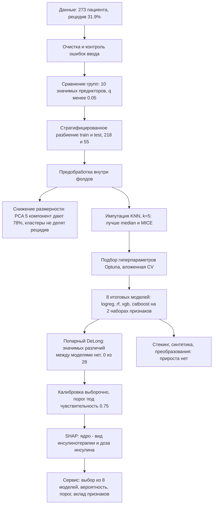
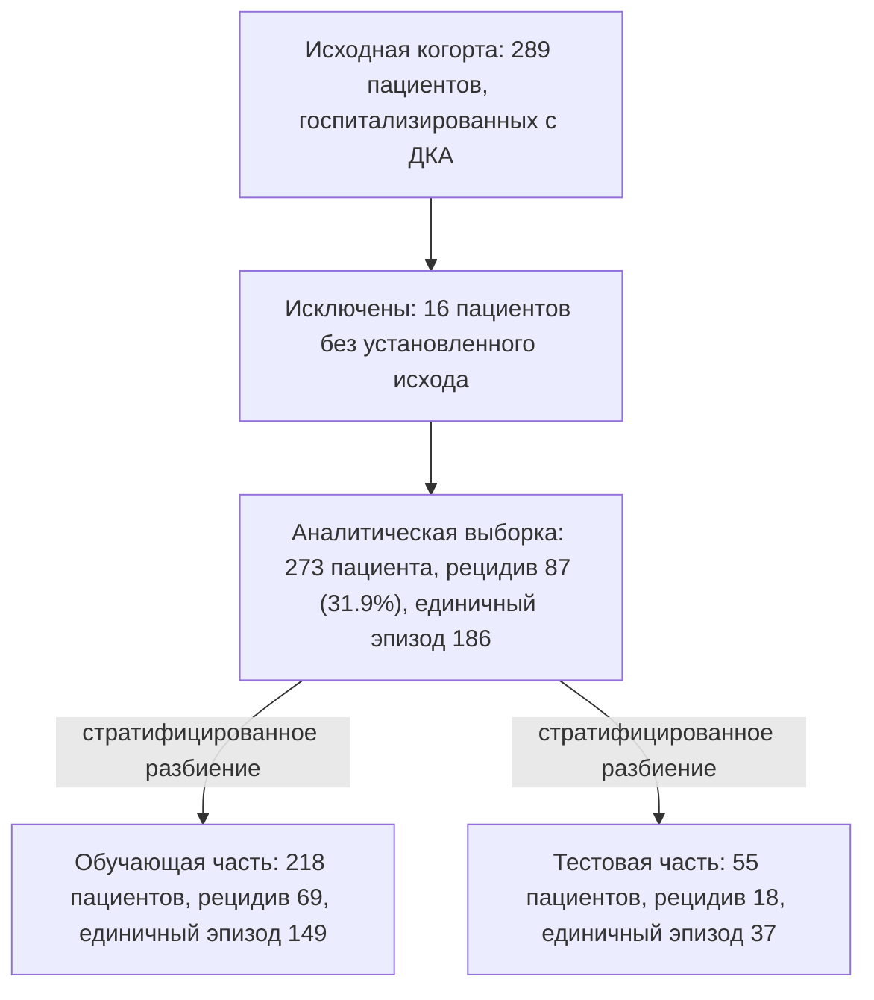

# Разработка и интерпретация моделей машинного обучения для прогнозирования рецидива диабетического кетоацидоза

Авторы: Садыхов О.Б., Леоненко В.Н.

Университет ИТМО, факультет технологий искусственного интеллекта, Санкт-Петербург, Россия

Автор для переписки: Садыхов О.Б., ovelsad@niuitmo.ru

Дата: 10 июня 2026 г.

## Аннотация

- Цель: построить интерпретируемую прогностическую модель рецидива диабетического
  кетоацидоза по клиническим данным пациента, реализовать сервис поддержки принятия решений
  врача в реальном времени и проверить гипотезу о связи приема алкоголя с рецидивом.
- Методы: ретроспективное одноцентровое исследование, включающее выборку из 289 пациентов, из них 273 с известным
  исходом (рецидив 87, единичный эпизод 186, доля рецидивов 31.9%). Исход бинарный,
  стратифицированное разбиение на обучающую и тестовую части, подбор гиперпараметров
  во вложенной кросс-валидации, калибровка вероятностей и анализ кривых принятия
  решений. Разделяющую способность моделей сравнивали попарно критерием DeLong с
  поправкой Бенджамини-Хохберга.
- Результаты: подобраны восемь итоговых моделей (логистическая регрессия, случайный
  лес, XGBoost, CatBoost на двух наборах признаков). ROC-AUC по
  вложенной кросс-валидации 0.68-0.78 (лидер случайный лес на наборе без
  мультиколлинеарности 0.775), на отложенном тесте 0.72-0.80. Попарные критерии DeLong
  с поправкой Бенджамини-Хохберга не выявили значимых различий между ними ни на
  обучающей части, ни на тесте (0 значимых пар из 28 в обоих случаях). В частности, ни
  одна из сложных моделей не превзошла логистическую регрессию: на обучающей части их
  преимущество незначимо (DeLong с поправкой p = 0.09), на тесте логистическая регрессия
  выше остальных. Единую лучшую модель мы не выделяем и включаем в сервис все восемь.
  Стекинг, синтетическая балансировка и преобразования признаков не
  привели к приросту качества модели. Предикторы с поправкой Бенджамини-Хохберга (q менее 0.05, всего 10): суточная
  доза инсулина, вид инсулинотерапии, длительность СД, ЛПВП, стадия ХБП и альбуминурия,
  диабетическая ретинопатия, диабетическая полинейропатия, прием алкоголя, HbA1c. Калибровку применяли
  выборочно, методом Платта там, где он снижает индекс Бриера. Порог подбирали под
  целевую чувствительность не ниже 0.75, на тесте это дает высокий NPV (0.75-0.92) при
  умеренном PPV (0.41-0.57). Гипотеза о связи приема алкоголя за сутки до эпизода с рецидивом
  подтвердилась (отношение шансов 2.27, p = 0.008).
- Выводы: модели применимы как инструмент скрининга риска. Для клинического внедрения
  нужны более крупная и полная обучающая выборка и внешняя валидация на
  данных другого центра.

Ключевые слова: диабетический кетоацидоз, рецидив, прогностическая модель, машинное
обучение, калибровка, поддержка принятия решений.

Keywords: diabetic ketoacidosis, recurrence, prognostic model, machine learning,
calibration, clinical decision support.

## Схема этапов исследования

Дерево ниже показывает путь работы. Основная линия ведет от данных к сервису, от нее
ответвляются изученные решения с короткими выводами.

Обобщающий вывод: простая логистическая регрессия на сырых данных дает ROC-AUC 0.659,
подготовка данных и подбор модели поднимают разделяющую способность до 0.72-0.80. Выше
этого уровня продвинуться не удалось ни бэггингом, ни градиентным бустингом, ни
стекингом, ни синтетической балансировкой, ни преобразованиями признаков. Попарные
критерии DeLong не выявили значимых различий между восемью итоговыми моделями
(логистическая регрессия, случайный лес, XGBoost и CatBoost на двух наборах признаков),
поэтому единую лучшую модель мы не выделяем. Все восемь моделей доступны в сервисе
поддержки принятия решений, выбор остается за врачом.

## Введение

Диабетический кетоацидоз - жизнеугрожающее осложнение сахарного диабета, для
которого характерны гипергликемия, метаболический ацидоз и
повышенная концентрация кетоновых тел [1]. За период с 2003 по 2014 год в США
зарегистрировано 1 760 101 первичная госпитализация по поводу ДКА, а число выписок
с основным диагнозом ДКА выросло со 118 808 в 2003 году до 188 965 в 2014 году.
Внутрибольничная летальность за этот период составила 0.4% [2]. После купирования
острого состояния единичные случаи могут перерастать в повторные эпизоды, а
рецидивирующее течение ДКА сопряжено с существенно более высокой летальностью [3, 4].

Повторные эпизоды ДКА редко объясняются одной причиной. В литературе к факторам
риска повторных госпитализаций относят молодой возраст, психиатрические
расстройства, инфекции, несоблюдение режима терапии, злоупотребление алкоголем и
психоактивными веществами, а также социально-экономические обстоятельства:
принадлежность к этническим меньшинствам, государственное медицинское страхование,
финансовые ограничения и социальную депривацию [5, 6, 7]. В повседневной практике врачу трудно
заранее оценить, насколько высок риск повторного эпизода у конкретного пациента.
Несмотря на десятилетия клинического опыта, оптимальные стратегии ведения ДКА
остаются предметом дискуссий [8]. Набор факторов разнороден, а единого инструмента
для оценки риска повторных эпизодов пока нет. Из-за этого врачи испытывают дефицит
готовых решений для прогноза опасных эпизодов, такими решениями могут стать
прогностические модели машинного обучения [9].

Методы машинного обучения и искусственного интеллекта здесь перспективны.
Отдельные модели достигают ROC-AUC порядка 0.82-0.85 [9, 10], но их обобщающая
способность ограничена: работы опираются на однородные популяции и отдельные
источники данных с высокой долей пропусков, поэтому на других выборках метрики
обычно не воспроизводятся, а применимость остается узкой [10]. Кроме того, ранее
показано [11, 12], что многие модели работают как черный ящик: их выводы трудно
интерпретировать и объяснить, что становится барьером для применения. Именно это снижает доверие врачей и сдерживает
внедрение машинного обучения в медицине. В то же время современные работы по
прогнозированию в диабетологии применяют методы объяснения предсказаний, прежде
всего SHAP и LIME [13, 14]. При этом для прогнозирования рецидивов ДКА такие
инструменты почти не применяются. Отсюда потребность в интерпретируемых
прогностических инструментах для российской популяции.

В настоящей работе мы разрабатываем и внутренне валидируем прогностическую модель
повторных эпизодов ДКА по доступным клиническим показателям на российской
выборке. Акцент сделан на интерпретируемости предикторов, клинической применимости
и подготовке прототипа сервиса поддержки принятия решений.

Мы проверяем гипотезу о связи приема алкоголя с рецидивом. В литературе прием алкоголя
описан как фактор рецидивирующего течения ДКА, который связан с повторными эпизодами ДКА
наряду с приемом психоактивных веществ. Кроме того, избыток алкоголя назван одним из частых
провоцирующих факторов эпизода [7]. Связь подтверждают и работы по повторным
госпитализациям: исследование случай-контроль [15] и шкала риска ABCD, где
злоупотребление алкоголем и психоактивными веществами входит в число предикторов
повторного поступления пациента [16]. Остается выяснить, переносится ли эта связь на нашу
выборку. Нулевая гипотеза: прием алкоголя за сутки до эпизода не связан с рецидивирующим
течением, отношение шансов равно 1. Альтернативная гипотеза: связь есть, отношение шансов
отличается от 1.

## Методы

### Дизайн и источник данных

Ретроспективное одноцентровое исследование на обезличенных данных. Учреждение не
раскрывается по соглашению о конфиденциальности. В анализ включены пациенты,
госпитализированные с диабетическим кетоацидозом в период с 2019 по 2025 год.
Критерии включения - возраст 18 лет и старше и подтвержденный диагноз ДКА. Критерии
исключения - утраченные или существенно неполные данные истории болезни. Это демонстрационная выборка из 289 пациентов, исход
известен у 273.

### Исход

Целевая переменная - рецидивирующее течение ДКА (0 - единичный эпизод, 1 - рецидив).
Пациента относили к группе рецидива, если за время наблюдения у него зарегистрировано
более одного эпизода ДКА. Это устанавливали по анамнезу на момент поступления, когда
пациент уже перенес несколько эпизодов, или по новому эпизоду, возникшему во время
госпитализации. Единичным считали первое обращение или единственный эпизод за период
наблюдения. Фиксированного окна наблюдения не было, исход определяли по совокупности
анамнеза и периода госпитализации.

### Предикторы

Использованы показатели, собранные при госпитализации с диагнозом ДКА. Это демографические данные
(возраст, пол), анамнез и терапия СД (тип, длительность, возраст манифестации, вид
инсулинотерапии, суточная доза), лабораторные показатели при поступлении (газы крови,
электролиты, креатинин, мочевина, глюкоза, HbA1c, липидограмма), осложнения (ХБП по стадии и
альбуминурии, диабетические ретинопатия и полинейропатия) и фактор образа жизни (прием алкоголя). Все
предикторы доступны на момент госпитализации. Рассмотрены два набора признаков:
значимые по результатам сравнения групп (10) и набор без выраженной мультиколлинеарности
(25). Возраст почти линейно связан с возрастом манифестации и длительностью СД (коэффициент
корреляции Пирсона r около 0.99), поэтому возраст манифестации исключали из этого набора
как линейно зависимый, прочие предикторы сохранены. Набор
значимых признаков отобран по сравнению групп на полной когорте, до разделения на
обучающую и тестовую части. Такой предварительный отбор на всей выборке может несколько
завышать оценку именно для этого набора, что отмечено в ограничениях. Набор без
мультиколлинеарности от исхода не зависит и такого смещения не несет.

### Размер выборки

Формального расчета размера выборки не проводили, использована вся доступная
демонстрационная выборка (273 пациента с известным исходом, доля рецидивов 31.9%, 87
событий рецидива). При 87 событиях рецидива на каждый из 10 или 25 признаков приходится
мало наблюдений редкого класса, что повышает риск переобучения. Поэтому мы ограничили
размерность, применяли регуляризацию и взвешивание классов. Обобщение и отсутствие
переобучения проверяли тремя независимыми способами: согласием оценок на вложенной
кросс-валидации и отложенном тесте, OOB-оценкой случайного леса (бэггинг деревьев) и 95%
доверительными интервалами метрик по бутстрэпу.

### Пропущенные данные

Доля пропусков по показателям менялась от единиц процентов до 58% (HbA1c, натрий,
калий, лактат). Механизм оценен преимущественно как MAR с панельной структурой,
когда лабораторные показатели пропадают группами. Сравнили стратегии импутации -
медиану и моду, KNN, MICE и ручную клиническую импутацию по правилам (арифметика
возраста, формула Фридвальда для ЛПНП, степень тяжести из pH, групповые медианы
острых показателей по тяжести, креатинин по полу). Импутер обучали только на
обучающей части внутри фолдов. На тесте пропуски заполняли по ближайшим соседям из
обучающей части, без использования исхода и других тестовых строк, чтобы не было утечки
в тест. Рабочей выбрана
KNN-импутация с пятью соседями. Она превосходила остальные стратегии по качеству модели
и при этом не искажала форму распределений: по критерию Колмогорова-Смирнова
распределения до и после импутации значимо не различались, а пиковые значения не
стягивались к медиане, как при заполнении медианой. Число соседей сравнивали отдельно
(k от 3 до 11) по out-of-fold ROC-AUC на обучающей части, оптимальным оказалось k = 5
(ROC-AUC лидера 0.772 против 0.72-0.76 при остальных значениях k).

### Статистический анализ

Нормальность проверяли критерием Шапиро-Уилка при n менее 50 и критерием
Колмогорова-Смирнова в варианте Лиллиефорса (с оценкой параметров по выборке) при
n не менее 50. Количественные показатели при нормальном распределении описывали
средним и стандартным отклонением с 95% доверительным интервалом, при отличии от
нормального - медианой и квартилями. Группы сравнивали t-критерием Стьюдента,
U-критерием Манна-Уитни или W-критерием Бруннера-Мюнцеля в зависимости от
нормальности и равенства дисперсий (критерий Левена). Доли в четырехпольных таблицах
сравнивали критерием хи-квадрат Пирсона при минимальной ожидаемой частоте более 10 и
точным критерием Фишера при ожидаемой частоте менее 10, 95% доверительный интервал для
долей считали методом Клоппера-Пирсона, размер эффекта - отношением шансов с 95%
доверительным интервалом. При множественных сравнениях применяли поправку
Бенджамини-Хохберга. Площади под ROC двух моделей на одних и тех же пациентах
сравнивали критерием DeLong для связанных ROC-кривых, дополнительно парным бутстрэпом
разницы AUC.

### Разработка модели

Выборку один раз стратифицированно разделили на обучающую (218) и тестовую (55) части.
Всю предобработку (импутацию, масштабирование, кодирование категориальных, балансировку)
выполняли внутри пайплайна и обучали только на обучающих фолдах. На этапе выбора
стратегий предобработки сравнили семейства моделей (логистическая регрессия, случайный
лес, LightGBM, CatBoost, XGBoost, метод опорных векторов, метод k ближайших соседей) по
осям импутации, балансировки, кодирования категориальных и преобразования количественных
признаков. По итогам в дальнейшую работу взяли четыре семейства, логистическую регрессию,
случайный лес, XGBoost и CatBoost, на двух наборах признаков, всего восемь
итоговых моделей. CatBoost обрабатывает категориальные признаки нативно, упорядоченными
целевыми статистиками, без one-hot кодирования. Дисбаланс классов учитывали взвешиванием
классов, синтетические методы (SMOTE, SMOTENC, BorderlineSMOTE, ADASYN) сравнивали
отдельно, и прироста они не дали. Гиперпараметры подбирали байесовским поиском Optuna
во вложенной кросс-валидации. Качество всей процедуры оценивали по внешней пятифолдовой
кросс-валидации, а внутри каждого обучающего фолда Optuna подбирала гиперпараметры по
отдельной трехфолдовой кросс-валидации. Внутреннее разбиение нужно, чтобы сравнивать
наборы гиперпараметров на данных, которые модель при обучении не видела. Финальные
гиперпараметры для развертывания подбирали отдельным запуском Optuna на всей обучающей
части.

### Оценка качества и клиническая польза

Качество оценивали по ROC-AUC, PR-AUC, чувствительности и специфичности, клиническую
пользу - анализом кривых принятия решений. Калибровку вероятностей проверяли по
out-of-fold калибровочным кривым и индексу Бриера: сырые вероятности сравнивали с методами
Платта и изотонической регрессии и применяли калибровку выборочно, только там, где она
снижала индекс Бриера не менее чем на 0.005, иначе оставляли сырые вероятности как более
устойчивые на малой выборке. Порог классификации подбирали для каждой модели отдельно на
out-of-fold вероятностях обучающей части: брали порог с целевой чувствительностью не ниже
0.75 и наибольшей при этом специфичностью, для сравнения приводили индекс Юдена. Найденный
порог фиксировали и проверяли на отложенном тесте, который использовали один раз.
Доверительные интервалы метрик получали бутстрэпом (2000 повторов).

### Интерпретация

Вклад признаков оценивали методом SHAP для всех итоговых моделей: линейный SHAP
(LinearExplainer) для логистической регрессии, TreeExplainer для случайного леса и
XGBoost, встроенные ShapValues для CatBoost. Вклады one-hot кодированных категорий суммировали обратно к исходному признаку.
У CatBoost ранжирование по SHAP сопоставляли со встроенной важностью (PredictionValuesChange)
коэффициентом ранговой корреляции Спирмена.

### Программное обеспечение и отчетность

Анализ выполнен на Python 3.11 с фиксированными версиями библиотек, код открыт.
Отчетность построена по рекомендациям TRIPOD+AI.

### Этическое одобрение

Работа выполнена на обезличенных ретроспективных данных и не требует одобрения этического
комитета.

## Результаты

### Характеристика участников

Поток пациентов от исходной когорты до обучающей и тестовой частей показан на
Рисунке 1.

Рисунок 1. Поток пациентов: формирование аналитической выборки и разбиение.

Группа без рецидива 186 пациентов, группа рецидива 87. В Таблице 1 собраны показатели
со значимым различием между группами после поправки Бенджамини-Хохберга (q менее 0.05),
всего 10. Полная характеристика когорты приведена в дополнительных материалах.

Таблица 1. Предикторы со значимым различием между группами (поправка Бенджамини-Хохберга).

| Показатель | Без рецидива (n=186) | Рецидив (n=87) | p | q (BH) | ОШ (95% ДИ) |
|---|---|---|---|---|---|
| Суточная доза инсулина, ед., Me [Q1; Q3] | 34 [0; 45] | 44 [35; 54] | менее 0.0001 | менее 0.0001 | |
| Вид инсулинотерапии, доля без инсулинотерапии (дебют или отказ от инсулинотерапии) | 28.9% | 1.1% | менее 0.0001 | менее 0.0001 | |
| ЛПВП, ммоль/л, Me [Q1; Q3] | 1.09 [0.83; 1.38] | 1.26 [1.06; 1.58] | 0.0007 | 0.0065 | |
| Длительность СД, лет, Me [Q1; Q3] | 6 [0; 12.5] | 9 [4; 15] | 0.0021 | 0.0139 | |
| HbA1c, %, Me [Q1; Q3] | 12.56 [10.28; 13.64] | 10.90 [8.91; 12.66] | 0.0058 | 0.0196 | |
| Ретинопатия, доля без ретинопатии | 65.4% | 48.1% | 0.0049 | 0.0196 | |
| ХБП, стадия С, доля без поражения (С0) | 56.3% | 25.8% | 0.0060 | 0.0196 | |
| ХБП, альбуминурия А, доля без альбуминурии (А0) | 52.7% | 27.8% | 0.0057 | 0.0196 | |
| Алкоголь за сутки до ДКА, доля | 15.3% | 29.1% | 0.0081 | 0.0234 | 2.27 [1.23; 4.20] |
| Диабетическая нейропатия (осмотр невролога), доля | 52.1% | 69.0% | 0.0108 | 0.0281 | 2.05 [1.17; 3.57] |

Для количественных показателей даны медиана и квартили. Для категориальных приведена доля характерного уровня от числа известных
значений в группе, пропуски в знаменатель не включены, отношение шансов рассчитано
только для бинарных показателей. По виду инсулинотерапии главное различие не в доле помповой терапии, а в
доле пациентов без инсулинотерапии: у группы без рецидива это 28.9% против 1.1% при
рецидиве, что отражает структурный сигнал дебюта (первый эпизод не может быть
рецидивом).

### Гипотеза о приеме алкоголя

Гипотезу о связи приема алкоголя за сутки до эпизода с рецидивом проверяли отдельно.
Значение признака известно у 269 пациентов из 273. Среди пациентов с рецидивом алкоголь
за сутки до эпизода принимали 29.1% (25 из 86), в группе единичного эпизода 15.3% (28 из
183). Минимальная ожидаемая частота в четырехпольной таблице 16.9, она больше 10,
поэтому по протоколу применен критерий хи-квадрат Пирсона: статистика критерия 7.01,
p = 0.008. Нулевую гипотезу об отсутствии связи отклоняем. Отношение шансов рецидива при
приеме алкоголя 2.27 (95% ДИ 1.23-4.20). Прием алкоголя накануне повышает шансы
рецидивирующего течения примерно вдвое. После поправки Бенджамини-Хохберга на
множественные сравнения в Таблице 1 связь сохраняет значимость (q = 0.023). Направление
эффекта согласуется с данными литературы по факторам рецидива ДКА [7, 15, 16].

### Разработка и качество модели

Гиперпараметры подобраны Optuna во вложенной кросс-валидации. Вложенная ROC-AUC по
итоговым моделям на двух наборах признаков приведена в Таблице 2.

Таблица 2. Разделяющая способность итоговых моделей по вложенной кросс-валидации.

| Модель | Набор | Вложенная ROC-AUC | SD |
|---|---|---|---|
| Случайный лес | no_collinear | 0.775 | 0.019 |
| XGBoost | no_collinear | 0.748 | 0.038 |
| CatBoost | no_collinear | 0.735 | 0.050 |
| Логистическая регрессия | no_collinear | 0.713 | 0.029 |
| Случайный лес | significant | 0.719 | 0.069 |
| XGBoost | significant | 0.710 | 0.106 |
| CatBoost | significant | 0.706 | 0.075 |
| Логистическая регрессия | significant | 0.680 | 0.082 |

Лидером на наборе без мультиколлинеарности стал случайный лес (ROC-AUC 0.775, самый узкий
разброс по фолдам), за ним XGBoost и CatBoost. У всех итоговых моделей 25 признаков дают
более высокую разделяющую способность, чем 10. LightGBM входил в шортлист, но в итоговые
модели не включен: подобранные для него гиперпараметры давали высокое качество на
внутренних фолдах подбора, но на внешних фолдах оно заметно падало, то есть настройка
подгонялась под конкретное разбиение. Подбор гиперпараметров не поднял качество над
разумными значениями по умолчанию из этапа выбора стратегий, где лучшая конфигурация
давала около 0.78 на одиночной кросс-валидации: основной рычаг - выбор модели и набора
признаков, а не тонкая настройка, что ожидаемо при выборке в 218 пациентов. Единую
основную модель не выделяем, так как попарные сравнения итоговых моделей не обнаружили
значимых различий, поэтому в сервис поддержки принятия решений включаем все восемь
моделей.

### Устойчивость оценок и отсутствие переобучения

Для каждой из итоговых моделей получены ROC-AUC и PR-AUC по out-of-fold с 95% доверительным
интервалом по бутстрэпу. В отличие от Таблицы 2, где гиперпараметры переподбираются в
каждом внешнем фолде, а ROC-AUC усредняется по фолдам, здесь зафиксирован финальный набор
гиперпараметров, а ROC-AUC посчитан на объединенных out-of-fold предсказаниях, поэтому
числа немного расходятся. Лучшая оценка у случайного леса на наборе без
мультиколлинеарности: ROC-AUC 0.772 [0.710; 0.833], следом CatBoost 0.764 и XGBoost
0.761, на наборе значимых признаков метрика получена около 0.73 для всех моделей. Различия проверялись
попарным критерием DeLong (см. раздел об оценке на тесте). PR-AUC держится в диапазоне
0.50-0.55 при базовой линии случайного классификатора около 0.32, то есть модели несут
сигнал для несбалансированной задачи. OOB-оценка
случайного леса согласуется с out-of-fold (0.721 против 0.732 на значимом наборе и
0.749 против 0.772 на наборе без мультиколлинеарности) - две независимые оценки
совпадают, признаков переобучения нет. Качество на отложенном тесте (диапазон
0.72-0.80) согласуется с вложенной кросс-валидацией.

### Оценка на отложенном тесте

Разделяющая способность обученных моделей на тестовом наборе
приведена в Таблице 3.

Таблица 3. Разделяющая способность моделей на отложенном тесте.

| Модель | Набор | ROC-AUC (95% ДИ) |
|---|---|---|
| Логистическая регрессия | no_collinear | 0.802 [0.672; 0.912] |
| XGBoost | significant | 0.769 [0.632; 0.889] |
| XGBoost | no_collinear | 0.769 [0.630; 0.888] |
| CatBoost | significant | 0.739 [0.587; 0.864] |
| CatBoost | no_collinear | 0.739 [0.587; 0.868] |
| Случайный лес | significant | 0.734 [0.579; 0.864] |
| Логистическая регрессия | significant | 0.731 [0.582; 0.861] |
| Случайный лес | no_collinear | 0.724 [0.576; 0.851] |

Все оценки лежат в интервале 0.72-0.80. Доверительные интервалы на тесте широкие, в
среднем около 0.27 по ширине, и сильно перекрываются, поэтому ранжировать модели только
по результату на тесте нельзя. Ранжирование на тесте разошлось с вложенной
кросс-валидацией. Например, случайный лес, лидер на CV на наборе без мультиколлинеарности,
на тесте опустился вниз рейтинга, а логистическая регрессия на том же наборе показала
наилучший результат.

Чтобы не судить о различиях по перекрытию интервалов, мы сравнили все восемь моделей
попарно критерием DeLong для связанных ROC-кривых с поправкой Бенджамини-Хохберга на 28
сравнений. Ни одна пара не показала значимого различия: ни на out-of-fold обучающей
части, ни на отложенном тесте. Это не доказывает
равенства моделей, при выборке в 55 человек мощность теста мала, но и не дает оснований
выделить какую-то модель как лучшую. Поэтому в сервис мы включаем все восемь итоговых моделей.

### Сложные модели против логистической регрессии

Отдельно сопоставили бустинговые алгоритмы и бэггинг случайного леса с логистической регрессией на наборе
без мультиколлинеарности, парным критерием DeLong с поправкой Бенджамини-Хохберга,
отдельно на out-of-fold обучающей части и на тесте (Таблица 4). На обучающей части все
три модели номинально выше логрега (разница около 0.04-0.05), но после поправки различие
незначимо ни у одной (p = 0.09). На отложенном тесте знак разницы обратный: логистическая
регрессия выше всех трех сложных моделей (на 0.03-0.08), и здесь различия тоже незначимы.
Устойчивого преимущества сложных моделей по разделяющей способности на этой выборке нет.
Это согласуется с систематическим обзором, где машинное обучение не превзошло
логистическую регрессию [17].

Таблица 4. Сложные модели против логистической регрессии (набор без мультиколлинеарности), критерий DeLong.

| Выборка | Сложная модель | AUC сложной | AUC логрега | Разница | DeLong p (BH) |
|---|---|---|---|---|---|
| OOF | случайный лес | 0.772 | 0.719 | +0.052 | 0.09 |
| OOF | XGBoost | 0.761 | 0.719 | +0.041 | 0.09 |
| OOF | CatBoost | 0.764 | 0.719 | +0.045 | 0.09 |
| тест | случайный лес | 0.724 | 0.802 | -0.078 | 0.50 |
| тест | XGBoost | 0.769 | 0.802 | -0.033 | 0.55 |
| тест | CatBoost | 0.739 | 0.802 | -0.063 | 0.50 |

### Калибровка и выбор порога

Калибровку оценивали по out-of-fold на обучающей части. На наборе без
мультиколлинеарности сырые вероятности уже хорошо откалиброваны (индекс Бриера
0.178-0.189), Платт и изотоническая их не улучшают. Заметный выигрыш от Платта есть
только у логистической регрессии и случайного леса на значимом наборе (индекс Бриера
0.199 против 0.189 и 0.203 против 0.183). Поэтому калибровку применяли выборочно: Платт
у этих двух моделей, сырые вероятности у остальных шести.

Порог подбирали и фиксировали для каждой из итоговых моделей на out-of-fold вероятностях обучающей части по
целевой чувствительности не ниже 0.75. На обучающей части
чувствительность держалась у цели (0.75-0.78) при специфичности 0.52-0.68 в
зависимости от модели и набора. На тесте порог переносился с разбросом, ожидаемым при
18 событиях: чувствительность 0.50-0.89, специфичность 0.49-0.73. Лучшая рабочая точка
на тесте у XGBoost - чувствительность 0.72 при специфичности 0.73. Высокий NPV
(0.75-0.92) при умеренном PPV (0.41-0.57) отражает распространенность исхода и
соответствует задаче скрининга: модель надежнее отсеивает низкий риск, чем подтверждает
высокий.

### Преобразования признаков

Влияние преобразований количественных признаков (логарифм и Йео-Джонсон по схеме
скошенности против только стандартизации) проверено на этапе выбора стратегий для
всех моделей и обоих наборов. Значимого
выигрыша нет ни у одной модели. Деревья ожидаемо инвариантны к монотонным
преобразованиям отдельных признаков. В пайплайне оставлена стандартизация без
дополнительного преобразования.

### Стекинг

Базовыми были выбраны восемь итоговых моделей,
мета-моделью - логистическая регрессия над их out-of-fold предсказаниями. Перебрали все
комбинации от двух базовых моделей и сравнили их по out-of-fold ROC-AUC. Лучшая комбинация
дала 0.7705, что близко к лучшей одиночной модели, но не превышает ее. Двухмодельный стек был не хуже комбинаций
из четырех-пяти, то есть добавление базовых моделей качество не повышало. На нашей выборке заметного прироста стекинг не дал, а
интерпретируемость при этом снижается, ведь вклад признаков приходится прослеживать через
мета-модель. Поэтому стекинг в сервис не включаем.
На большей выборке выигрыш от стекинга не исключен, это направление для дальнейшей работы.

### Синтетическая балансировка

На лучшей модели, случайном лесе на наборе без мультиколлинеарности, сравнили
синтетические методы SMOTENC, BorderlineSMOTE, ADASYN и обычный SMOTE с двумя
несинтетическими вариантами (взвешиванием классов и отсутствием балансировки) по пяти
повторам кросс-валидации с разными случайными разбиениями. Оверсэмплинг выполняли только внутри фолдов, оценивали на реальной валидации.
Синтетика прироста не дала: ROC-AUC у синтетических методов 0.715-0.725, тогда как без
балансировки 0.729, а при взвешивании классов 0.737. То есть лучший результат дал
несинтетический прием взвешивания классов, которое не создает новых строк, а лишь
повышает вес редкого класса в функции потерь. PR-AUC у синтетики даже чуть ниже, а индекс
Бриера растет с 0.187 до 0.193-0.200, то есть калибровка ухудшается.
Синтетическую балансировку в пайплайн не включили.

### Значимость признаков

SHAP рассчитан для всех итоговых моделей. На значимом наборе
в топ-5 у всех четырех семейств одновременно прослеживаются вид инсулинотерапии и стадия ХБП-С, на
наборе из 25 признаков общими в топ-10 оказались вид инсулинотерапии, суточная доза
инсулина, HbA1c, ЛПВП и глюкоза при поступлении. Логистическая регрессия дополнительно поднимает
электролиты (натрий, калий), случайный лес и XGBoost - длительность СД, CatBoost - тип СД,
а общий холестерин и мочевину поднимают все три более сложные модели. Это отражает разную
природу моделей. У CatBoost ранжирование по SHAP согласуется со
встроенной важностью (PredictionValuesChange): коэффициент Спирмена 0.79 на значимом
наборе и 0.90 на наборе без мультиколлинеарности.

## Обсуждение

Мы построили модели прогноза рецидивирующего течения ДКА по клиническим показателям и проверили их на отложенном тесте.
Разделяющая способность держится в диапазоне 0.68-0.78 на вложенной
кросс-валидации и 0.72-0.80 на отложенном тесте. KNN-импутация с пятью соседями оказалась лучшей
среди стратегий заполнения пропусков, а взвешивание классов лучшим среди приемов
балансировки. Поднять разделяющую способность не удалось ни градиентному
бустингу, ни стекингу, ни синтетической балансировке, ни преобразованиям количественных
признаков. Попарные критерии DeLong с поправкой Бенджамини-Хохберга не выявили значимых
различий между восемью итоговыми моделями ни на обучающей, ни на тестовой частях. 
Это не доказывает равенства моделей, мощность теста при таком объеме мала, но и не дает
оснований выделить одну как лучшую, поэтому в сервис мы выносим все восемь итоговых
моделей, оставляя выбор за врачом.

Сложные модели не дали устойчивого преимущества над логистической регрессией. На вложенной
кросс-валидации случайный лес, XGBoost и CatBoost номинально выше логистической регрессии,
но на отложенном тесте порядок обратный: выше всех оказалась логистическая
регрессия (0.802). Логистическая регрессия
ценна как самая простая и интерпретируемая модель с естественной калибровкой. Случайный
лес и XGBoost дают то же качество за счет нелинейных взаимодействий. CatBoost удобен тем,
что обрабатывает категориальные признаки без one-hot кодирования. Все модели допускают
регулировку порога под клиническую задачу.

Состав значимых предикторов оказался устойчивым: вид инсулинотерапии, суточная доза
инсулина, HbA1c, ЛПВП и стадия ХБП попадают и в значимые по Таблице 1, и в общее ядро SHAP
сразу у всех моделей. Совпадение результатов классической статистики и метода
объяснения предсказаний, полученное двумя независимыми путями, усиливает доверие к набору
факторов.

По разделяющей способности наши оценки скромнее опубликованных: на когорте взрослых с
СД 1 типа получили ROC-AUC около 0.82 [10], причем различия между
методами машинного обучения и логистической регрессией у них были минимальны, что
согласуется с нашим результатом. ROC-AUC до 0.85 показывает модель
на когорте детей с СД 1 типа [9]. Разрыв с нашими оценками
объясняется объемом и характером данных, а также определением исхода. У нас
демонстрационная одноцентровая выборка из 273 пациентов, тогда как в работе по взрослым [10]
анализировали около 15 тысяч наблюдений из крупной базы EHR, а в детской работе [9] -
продольные данные 1745 пациентов за несколько лет с моделью глубокого обучения. Мы
прогнозировали рецидивирующее течение по совокупности анамнеза и периода госпитализации
без фиксированного окна, тогда как часть литературных источников предсказывает
госпитализацию или повторную госпитализацию в заданном временном окне. Гипотеза о связи приема алкоголя за сутки до эпизода с
рецидивирующим течением подтвердилась (отношение шансов 2.27, p = 0.008), что переносит
известный фактор риска на нашу популяцию [7, 15, 16].

Главная сильная сторона работы - строгая методология без утечек данных. Разбиение на
обучающую и тестовую части сделано один раз и до любой предобработки, а импутацию,
масштабирование и отбор обучают внутри фолдов кросс-валидации. Это дает несмещенную оценку того, как модель
поведет себя на новых пациентах, что особенно важно при малой выборке, где утечка легко
завышает метрики. Отсутствие переобучения подтверждено тремя независимыми способами:
согласием вложенной кросс-валидации и отложенного теста, совпадением OOB-оценки леса
с out-of-fold оценкой и широкими, но согласованными бутстрэп-интервалами. Помимо
разделяющей способности мы оценили калибровку и клиническую пользу через анализ
кривых принятия решений, а интерпретацию провели SHAP по всем итоговым моделям, сверили со
статистикой и встроенной важностью CatBoost.

Ограничения работы связаны прежде всего с данными: выборка одноцентровая, малая и
демонстрационная, внешней валидации на независимой популяции нет. Доля пропусков в части
лабораторных показателей высокая (до 58% по HbA1c, натрию, калию и лактату), и хотя
KNN-импутация не исказила распределения, неопределенность сохраняется. Набор значимых признаков
отобран по сравнению групп на полной когорте, до разделения на обучающую и тестовую части,
поэтому оценка именно для этого набора может быть несколько завышена. Набор без
мультиколлинеарности от исхода не зависит и такого смещения не несет, и на нем получены
лучшие оценки.

Прикладной итог работы - прототип сервиса поддержки решений, собранный на основе модели.
Он по показателям пациента выдает вероятность рецидива, вклад признаков и регулируемый
порог, дает выбор из восьми итоговых моделей на двух наборах признаков. Рабочий режим - скрининг: порог подобран под
целевую чувствительность не ниже 0.75, при которой модели дают высокий NPV (0.75-0.92)
при умеренном PPV (0.41-0.57), то есть надежнее отсеивают пациентов низкого риска, чем
подтверждают высокий. Сервис задуман как вспомогательный инструмент врача, а не как
средство постановки диагноза.

## Выводы

По рутинным клиническим показателям рецидивирующее течение ДКА прогнозируется с умеренной
разделяющей способностью около 0.68-0.78 по вложенной кросс-валидации. Сложные модели,
стекинг и синтетическая балансировка преимущества над более простыми не дали, а попарные
критерии DeLong не выявили значимых различий между восемью итоговыми моделями. Поэтому единую
модель мы не выделяем, в сервис вынесены все восемь с выбором за врачом. Устойчивое
ядро предикторов (вид инсулинотерапии, суточная доза инсулина, HbA1c, ЛПВП, стадия ХБП)
согласуется между классической статистикой и SHAP. Модели применимы как инструмент
скрининга риска с высоким NPV. Для клинического внедрения нужны более крупная и полнее
заполненная обучающая выборка и внешняя валидация на данных другого центра.

## Дополнительные разделы

- Доступность данных: данные пациентов закрыты, доступ по обоснованному запросу в
  рамках этических ограничений.
- Доступность кода: открытый репозиторий, фиксированные версии, инструкции по
  воспроизведению.
- Дополнительные материалы: полные таблицы результатов (характеристика когорты,
  подбор гиперпараметров, калибровка, пороги, стекинг, синтетическая балансировка) и
  рисунки SHAP доступны в репозитории и предоставляются по запросу.
- Этическое одобрение: работа выполнена на обезличенных ретроспективных данных и не
  требует одобрения этического комитета.
- Финансирование: исследование выполнено без внешнего финансирования.
- Конфликт интересов: авторы заявляют об отсутствии конфликта интересов.
- Вклад авторов: Садыхов О.Б. - концепция исследования, подготовка и анализ данных,
  разработка и валидация моделей, реализация сервиса, написание рукописи. Леоненко В.Н. -
  научное руководство, концепция исследования, критический пересмотр и редактирование
  рукописи, утверждение окончательного варианта.
- Благодарности: авторы благодарят научного руководителя и врачей, предоставивших
  клинические данные.

## Список литературы

1. Benoit SR, Zhang Y, Geiss LS, Gregg EW, Albright A. Trends in diabetic
   ketoacidosis hospitalizations and in-hospital mortality - United States,
   2000-2014. MMWR Morb Mortal Wkly Rep. 2018;67(12):362-365.
   https://www.ncbi.nlm.nih.gov/pmc/articles/PMC5877353/
2. Desai D, Mehta D, Mathias P, Menon G, Schubart UK. Health care utilization and
   burden of diabetic ketoacidosis in the U.S. over the past decade: a nationwide
   analysis. Diabetes Care. 2018;41(8):1631-1638.
   https://pubmed.ncbi.nlm.nih.gov/29773640/
3. Santos SS, Ramaldes LAL, Dualib PM, Gabbay MAL, Sa JR, Dib SA. Increased risk of
   death following recurrent ketoacidosis admissions: a Brazilian cohort study of
   young adults with type 1 diabetes. Diabetol Metab Syndr. 2023;15(1):85.
   https://pmc.ncbi.nlm.nih.gov/articles/PMC10141950/
4. Gibb FW, Teoh WL, Graham J, Lockman KA. Risk of death following admission to a UK
   hospital with diabetic ketoacidosis. Diabetologia. 2016;59(10):2082-2087.
   https://pmc.ncbi.nlm.nih.gov/articles/PMC5016550/
5. Mohler R, Lotharius K, Moothedan E, Goguen J, Bandi R, Beaton R, Knecht M,
   Mejia MC, Khoury M, Sacca L. Factors contributing to diabetic ketoacidosis
   readmission in hospital settings in the United States: a scoping review. J
   Diabetes Complications. 2024;38(10):108835.
   https://pubmed.ncbi.nlm.nih.gov/39137675/
6. Dhatariya KK, Glaser NS, Codner E, Umpierrez GE. Diabetic ketoacidosis. Nat Rev
   Dis Primers. 2020;6(1):40. https://www.nature.com/articles/s41572-020-0165-1
7. Brandstaetter E, Bartal C, Sagy I, Jotkowitz A, Barski L. Recurrent diabetic
   ketoacidosis. Arch Endocrinol Metab. 2019;63(5):531-535.
   https://pmc.ncbi.nlm.nih.gov/articles/PMC10522260/
8. Omar Salem Kanzwl S, Alhajri AHM, Mohammed YJA, et al. A comparative
   effectiveness of intravenous fluids and insulin regimens in the acute management
   of diabetic ketoacidosis and hypoglycemia: a systematic review. Cureus.
   2025;17(10):e94902. https://pmc.ncbi.nlm.nih.gov/articles/PMC12624376/
9. Williams DD, Ferro D, Mullaney C, Skrabonja L, Barnes MS, Patton SR, Lockee B,
   Tallon EM, Vandervelden CA, Schweisberger C, Mehta S, McDonough R, Lind M,
   D'Avolio L, Clements MA. An all-data-on-hand deep learning model to predict
   hospitalization for diabetic ketoacidosis in youth with type 1 diabetes:
   development and validation study. JMIR Diabetes. 2023;8:e47592.
   https://diabetes.jmir.org/2023/1/e47592
10. Li L, Lee CC, Zhou FL, Molony C, Doder Z, Zalmover E, Sharma K, Juhaeri J, Wu C.
    Performance assessment of different machine learning approaches in predicting
    diabetic ketoacidosis in adults with type 1 diabetes using electronic health
    records data. Pharmacoepidemiol Drug Saf. 2021;30(5):610-618.
    https://pmc.ncbi.nlm.nih.gov/articles/PMC8049019/
11. Rudin C. Stop explaining black box machine learning models for high stakes
    decisions and use interpretable models instead. Nat Mach Intell.
    2019;1(5):206-215. https://www.nature.com/articles/s42256-019-0048-x
12. Stiglic G, Kocbek P, Fijacko N, Zitnik M, Verbert K, Cilar L. Interpretability
    of machine learning-based prediction models in healthcare. WIREs Data Min Knowl
    Discov. 2020;10(5):e1379. https://arxiv.org/pdf/2002.08596
13. Ahmed S, Kaiser MS, Hossain MS, Andersson K. A comparative analysis of LIME and
    SHAP interpreters with explainable ML-based diabetes predictions. IEEE Access.
    2024;12. doi:10.1109/ACCESS.2024.3422319.
    https://ieeexplore.ieee.org/document/10583856/
14. Emi-Johnson OG, Nkrumah KJ. Predicting 30-day hospital readmission in patients
    with diabetes using machine learning on electronic health record data. Cureus.
    2025;17(4):e82437. https://pmc.ncbi.nlm.nih.gov/articles/PMC12085305/
15. Cooper H, Tekiteki A, Khanolkar M, Braatvedt G. Risk factors for recurrent
    admissions with diabetic ketoacidosis: a case-control observational study.
    Diabet Med. 2016;33(4):523-528. https://pubmed.ncbi.nlm.nih.gov/26489986/
16. Bradford AL, Crider CC, Xu X, Naqvi SH. Predictors of recurrent hospital
    admission for patients presenting with diabetic ketoacidosis and hyperglycemic
    hyperosmolar state. J Clin Med Res. 2017;9(1):35-39.
    https://pubmed.ncbi.nlm.nih.gov/27924173/
17. Christodoulou E, Ma J, Collins GS, Steyerberg EW, Verbakel JY, Van Calster B. A
    systematic review shows no performance benefit of machine learning over logistic
    regression for clinical prediction models. J Clin Epidemiol. 2019;110:12-22.
    https://pubmed.ncbi.nlm.nih.gov/30763612/
